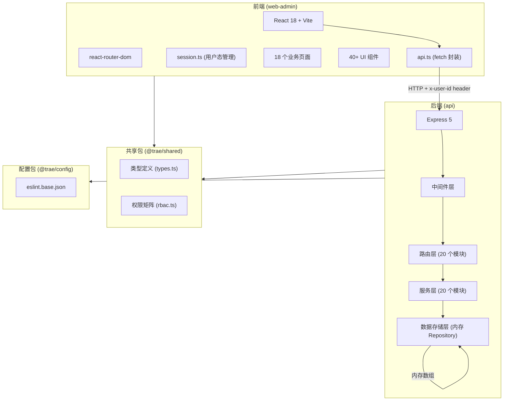
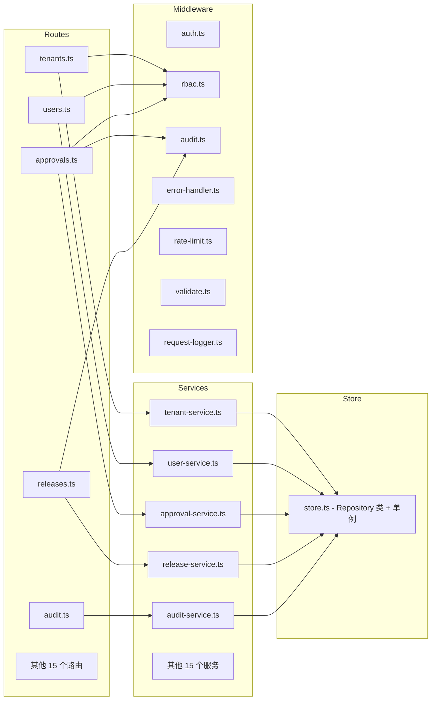
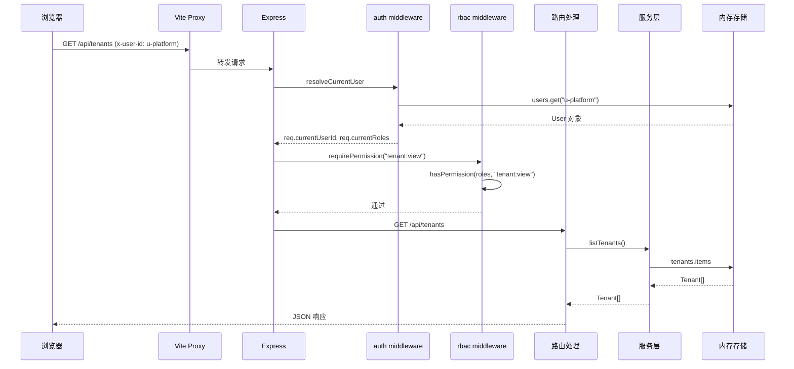
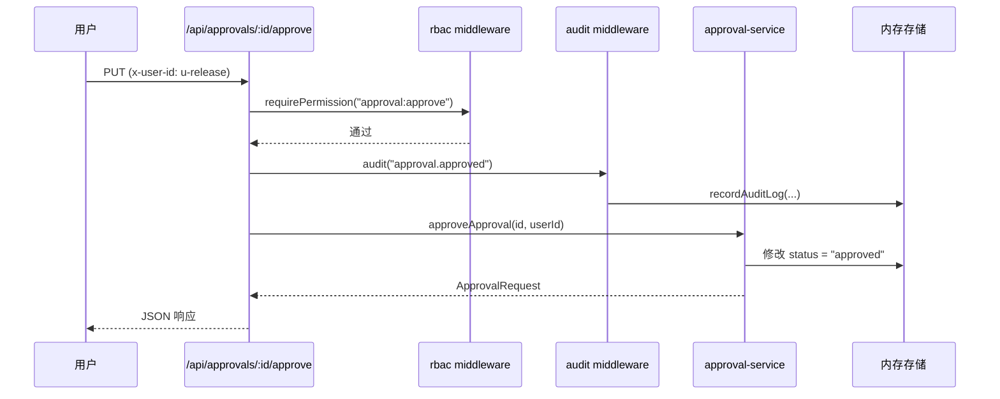

# ARCHITECTURE — 架构说明

## 整体架构图



## 分层结构

### 1. 前端层（apps/web-admin）

```
入口: main.tsx → App.tsx
路由: react-router-dom (BrowserRouter)
页面: pages/*.tsx (18 个业务页面)
组件: components/*.tsx (40+ 通用 UI 组件)
API: lib/api.ts (fetch 封装，自动附加 x-user-id)
会话: lib/session.ts (localStorage + 内存)
```

前端通过 Vite proxy 将 `/api` 请求转发到后端 `localhost:4100`。鉴权通过请求头 `x-user-id` 传递当前用户 ID。

### 2. 后端层（apps/api）

```
入口: server.ts → app.ts
中间件链（按顺序）:
  1. cors()              — 跨域
  2. express.json()      — JSON 解析
  3. requestLogger()     — 请求日志
  4. resolveCurrentUser  — 用户解析（从 x-user-id 头）
  5. apiRateLimiter      — 全局限流（60s/100次）
路由: routes/*.ts (20 个模块)
服务: services/*.ts (20 个模块)
存储: store.ts (内存 Repository 模式)
```

### 3. 共享层（packages/shared）

```
types.ts — 所有 TypeScript 类型/接口/枚举定义
rbac.ts  — 角色-权限映射矩阵 + 权限校验函数
index.ts — 统一导出
```

### 4. 配置层（packages/config）

```
eslint.base.json — 基础 ESLint 配置
```

## 模块职责与依赖关系



## 核心数据流

### 请求处理流程



### 审批流数据流



## 关键设计决策

### 1. 内存存储（无数据库）
项目使用内存 Repository 模式存储所有数据。每个实体对应一个 Repository 类，继承自泛型基类 `Repository<T>`。数据在服务启动时从 `data/seed.ts` 加载种子数据。

**影响**：重启后数据重置，不支持持久化。适合演示和测试，不适合生产。

### 2. 简化鉴权（x-user-id 头）
不使用 JWT/Session，通过 HTTP 请求头 `x-user-id` 标识当前用户。`auth.ts` 中间件从 store 中查找用户并设置 `req.currentUserId`、`req.currentTenantId`、`req.currentRoles`。

**影响**：方便测试和演示，但无真实安全保障。

### 3. RBAC 权限矩阵集中在 shared 包
`packages/shared/src/rbac.ts` 定义了 `ROLE_PERMISSIONS` 映射表，前后端共享同一份权限定义。前端用 `can()` 函数控制 UI 可见性，后端用 `requirePermission()` 中间件控制 API 访问。

### 4. Monorepo 结构
使用 pnpm workspace 管理三个包：`apps/api`、`apps/web-admin`、`packages/shared`。共享类型和 RBAC 逻辑通过 workspace 协议引用。

## 历史包袱与已知缺陷

代码中标注了 6 个预置缺陷（标记为"预置缺陷 N"），用于 AI Coding 验证场景：

| 编号 | 缺陷 | 位置 |
|------|------|------|
| 1 | 权限缺口：`PUT /api/users/:id/roles` 用 `user:edit` 而非 `role:edit` 校验 | routes/users.ts, middleware/rbac.ts |
| 2 | API 契约漂移：`ReleaseRecord` 的 `description` 字段在 shared types 中未定义 | shared/types.ts vs routes/releases.ts |
| 3 | 审批状态机缺陷：`approveApproval` 不校验当前状态，允许重复审批 | services/approval-service.ts |
| 4 | CI 配置问题：`legacy-node-check` job 用 Node 18 运行 TS 文件 | .github/workflows/ci.yml |
| 5 | 审计日志摘要为空：`audit()` 中间件写入空 summary | middleware/audit.ts |
| 6 | 前端按钮权限不一致：部分按钮可见性与后端 RBAC 不对齐 | web-admin pages |

## ❓待确认

- 是否有计划将内存存储迁移到真实数据库？迁移时 Repository 接口是否需要保持兼容？
- Express 5 目前仍是 prerelease 版本，是否有升级到稳定版的计划？
- 前端是否计划引入状态管理（当前仅用组件内 useState）？
- 是否有 API 版本化策略（如 `/api/v1/`）？
