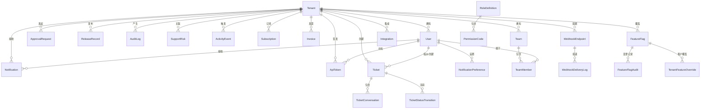

# DATA_MODEL — 数据模型

> 本项目使用内存存储，无持久化数据库。以下为内存中的数据结构定义。

## ER 图

## 核心实体

### Tenant（租户）
| 字段 | 类型 | 说明 |
|------|------|------|
| id | string | 主键，如 `tenant-acme` |
| name | string | 租户名称，如 "Acme 精密制造" |
| plan | `"standard"` \| `"enterprise"` | 订阅计划 |
| industry | string | 行业 |
| healthScore | number | 健康度评分（0-100） |
| contractEndsAt | string | 合同到期日（ISO 日期） |
| customerSuccessManager | string | CSM 姓名 |
| seatsUsed | number | 已用席位数 |
| seatsLimit | number | 席位上限 |
| monthlyActiveUsers | number | 月活用户数 |
| arr | number | 年度经常性收入（元） |
| subscriptionStatus? | SubscriptionStatus | 订阅状态 |
| createdAt? | string | 创建时间 |
| updatedAt? | string | 更新时间 |

**种子数据**：20 个租户，覆盖高端制造、金融 SaaS、连锁零售、医疗健康、新能源、航空航天等行业。

### User（用户）
| 字段 | 类型 | 说明 |
|------|------|------|
| id | string | 主键，如 `u-platform` |
| tenantId | string | 所属租户 ID |
| name | string | 用户姓名 |
| email | string | 邮箱 |
| roles | RoleCode[] | 角色列表 |
| isActive? | boolean | 是否激活 |
| createdAt? | string | 创建时间 |
| lastLoginAt? | string | 最后登录时间 |

**种子数据**：100+ 用户，每个租户下有 tenant_admin、member、auditor、release_manager 角色用户各 2-3 名，另有 5 个 platform_admin 跨租户用户。

### ApprovalRequest（审批请求）
| 字段 | 类型 | 说明 |
|------|------|------|
| id | string | 主键，如 `ap-1001` |
| tenantId | string | 所属租户 |
| title | string | 审批标题 |
| status | `"pending"` \| `"approved"` \| `"rejected"` | 审批状态 |
| requestedBy | string | 申请人 ID |
| decidedBy? | string | 决定人 ID |
| description? | string | 描述 |
| createdAt? | string | 创建时间 |
| decidedAt? | string | 决定时间 |

**种子数据**：50 条审批记录。

### ReleaseRecord（发布记录）
| 字段 | 类型 | 说明 |
|------|------|------|
| id | string | 主键 |
| tenantId | string | 所属租户 |
| version | string | 版本号 |
| environment | `"staging"` \| `"production"` | 部署环境 |
| status | `"pending"` \| `"deployed"` \| `"rolled_back"` | 发布状态 |
| operatorId | string | 操作人 ID |
| createdAt | string | 创建时间 |
| deployedAt? | string | 部署时间 |
| rolledBackAt? | string | 回滚时间 |
| description? | string | ⚠️ 预置缺陷 2：shared types 中未定义此字段 |
| changelog? | string | 变更日志 |

**种子数据**：80 条发布记录。

### AuditLog（审计日志）
| 字段 | 类型 | 说明 |
|------|------|------|
| id | string | 主键 |
| tenantId | string | 所属租户 |
| actorId | string | 操作人 ID |
| action | string | 操作类型，如 `approval.approved` |
| summary | string | 操作摘要（⚠️ 预置缺陷 5：部分为空） |
| createdAt | string | 创建时间 |
| details? | Record<string, unknown> | 详细信息 |
| resourceType? | string | 资源类型 |
| resourceId? | string | 资源 ID |

**种子数据**：150 条审计日志。

### SupportRisk（风险工单）
| 字段 | 类型 | 说明 |
|------|------|------|
| id | string | 主键 |
| tenantId | string | 所属租户 |
| title | string | 风险标题 |
| severity | `"critical"` \| `"high"` \| `"medium"` \| `"low"` | 严重度 |
| status | `"open"` \| `"in_progress"` \| `"waiting_customer"` \| `"resolved"` | 状态 |
| slaDueAt | string | SLA 到期时间 |
| ownerId | string | 负责人 ID |
| category | `"support"` \| `"security"` \| `"adoption"` \| `"billing"` \| `"release"` | 分类 |
| impact | string | 影响描述 |
| createdAt | string | 创建时间 |
| resolvedAt? | string | 解决时间 |
| description? | string | 描述 |

**种子数据**：40 条风险记录。

### ActivityEvent（活动事件）
| 字段 | 类型 | 说明 |
|------|------|------|
| id | string | 主键 |
| tenantId | string | 所属租户 |
| type | `"user"` \| `"approval"` \| `"release"` \| `"audit"` \| `"risk"` \| `"billing"` \| `"ticket"` | 事件类型 |
| title | string | 事件标题 |
| actorId | string | 触发人 ID |
| targetId? | string | 目标 ID |
| createdAt | string | 创建时间 |
| details? | Record<string, unknown> | 详细信息 |

**种子数据**：180 条活动事件。

## 订阅与计费

### Subscription（订阅）
| 字段 | 类型 | 说明 |
|------|------|------|
| id | string | 主键 |
| tenantId | string | 所属租户 |
| plan | SubscriptionPlan | `"free"` \| `"pro"` \| `"standard"` \| `"enterprise"` |
| period | BillingPeriod | `"monthly"` \| `"yearly"` |
| status | SubscriptionStatus | `"trial"` \| `"active"` \| `"past_due"` \| `"canceled"` \| `"cancelled"` \| `"expired"` |
| seats | number | 总席位数 |
| seatsUsed | number | 已用席位数 |
| monthlyRate | number | 月费率（元） |
| annualRate? | number | 年费率（元） |
| trialEndsAt? | string | 试用到期日 |
| nextBillingAt? | string | 下次计费日 |
| cancelAt? | string | 取消日 |
| createdAt | string | 创建时间 |
| updatedAt | string | 更新时间 |

**种子数据**：7 条订阅记录。

### Invoice（发票）
| 字段 | 类型 | 说明 |
|------|------|------|
| id | string | 主键 |
| tenantId | string | 所属租户 |
| subscriptionId | string | 关联订阅 |
| invoiceNumber | string | 发票编号 |
| status | InvoiceStatus | `"draft"` \| `"pending"` \| `"sent"` \| `"paid"` \| `"overdue"` \| `"canceled"` \| `"refunded"` |
| amount | number | 金额 |
| currency | string | 币种 |
| periodStart | string | 计费周期开始 |
| periodEnd | string | 计费周期结束 |
| issueDate | string | 开票日期 |
| dueDate | string | 到期日 |
| paidAt? | string | 支付日期 |
| items | InvoiceItem[] | 发票项目 |
| createdAt | string | 创建时间 |

**种子数据**：8 条发票记录。

## 其他实体

### Notification（通知）
- 类型枚举：`system_announcement`、`approval_request`、`approval_decision`、`release_deployed`、`release_rolled_back`、`risk_created`、`risk_updated`、`invoice_ready`、`invoice_overdue`、`subscription_renewal`、`feature_released`、`info`、`warning`、`error`、`success`、`system`
- **种子数据**：8 条通知

### WebhookEndpoint（Webhook 端点）
- 事件类型：`approvals.*`、`releases.*`、`tickets.*`、`billing.*`、`users.*`、`tenants.*`
- **种子数据**：4 个 Webhook

### ApiToken（API 令牌）
- 权限范围：`"read"` \| `"write"` \| `"admin"`
- **种子数据**：4 个 Token

### Team / TeamMember（团队与成员）
- **种子数据**：5 个团队，8 个成员关系

### Integration（系统集成）
- 类型：`"slack"` \| `"salesforce"` \| `"zendesk"` \| `"jira"` \| `"github"` \| `"stripe"` \| `"webhook"` \| `"custom"`
- 状态：`"not_configured"` \| `"connected"` \| `"error"` \| `"disabled"`
- **种子数据**：6 个集成

### FeatureFlag（功能开关）
- 类型：`"boolean"` \| `"string"` \| `"number"` \| `"json"` \| `"select"`
- 支持租户级覆盖（TenantFeatureOverride）和灰度比例（rolloutPercentage）
- **种子数据**：6 个开关

### Ticket（工单）
- 优先级：`"critical"` \| `"high"` \| `"medium"` \| `"low"`
- 状态：`"new"` \| `"open"` \| `"in_progress"` \| `"waiting_customer"` \| `"resolved"` \| `"closed"`
- 分类：`"support"` \| `"feature_request"` \| `"bug_report"` \| `"billing"` \| `"security"`
- **种子数据**：9 个工单，8 条会话，7 条状态流转

### RoleDefinition（角色定义）
- 类型：`"system"` \| `"custom"`
- **种子数据**：7 个角色（5 个系统角色 + 2 个自定义角色）

## 缓存结构

| 缓存 | 类型 | TTL | 用途 |
|------|------|-----|------|
| tenantCache | SimpleCache | 5 分钟 | 租户信息缓存 |
| permissionCache | SimpleCache | 5 分钟 | 用户权限缓存 |
| featureFlagCache | LRUCache (max 500) | 1 分钟 | 功能开关缓存 |

## 重要枚举值

### RoleCode
`platform_admin` | `tenant_admin` | `auditor` | `release_manager` | `member`

### PermissionCode（部分）
`tenant:view/edit/read/write/delete`、`user:view/edit/read/write/delete`、`role:view/edit/read/write/delete`、`approval:view/approve/read/write`、`release:view/deploy/read/write/rollback`、`audit:view/read/export`、`risk:read/write`、`activity:read`、`billing:view/edit`、`notification:view/manage/read`、`webhook:manage/read`、`metric:view/read`、`token:manage/read`、`team:manage/read/create`、`integration:manage/read/create`、`feature:manage/read`、`ticket:view/edit/manage/read`、`subscription:read/manage`、`invoice:read/manage`

### RBAC 权限矩阵
详见 [packages/shared/src/rbac.ts](../packages/shared/src/rbac.ts) 中的 `ROLE_PERMISSIONS`。

## ❓待确认

- 是否有计划引入真实数据库？如有，目标数据库是什么（PostgreSQL / MySQL / MongoDB）？
- 是否需要数据库迁移工具（如 Prisma / Drizzle）？
- 种子数据中的金额单位是否为人民币（CNY/元）？
- `SubscriptionStatus` 中同时存在 `"canceled"` 和 `"cancelled"`（英美拼写差异），是否为有意设计？
