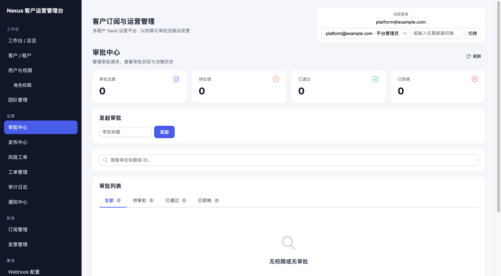
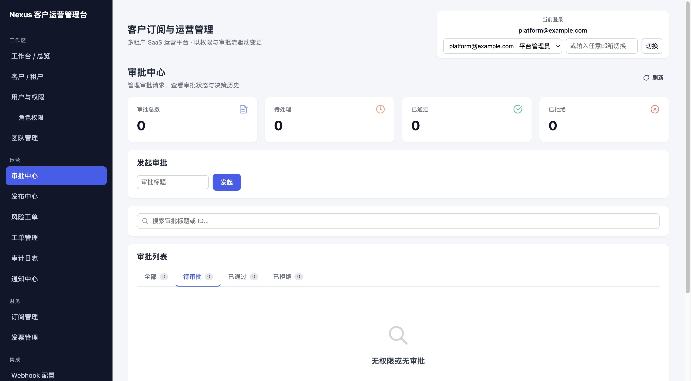
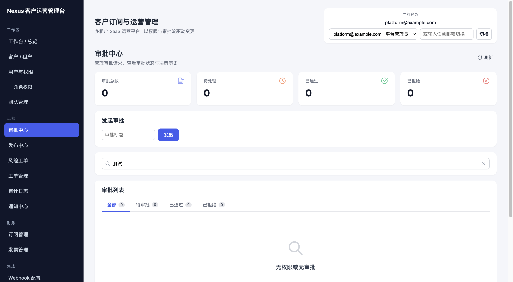
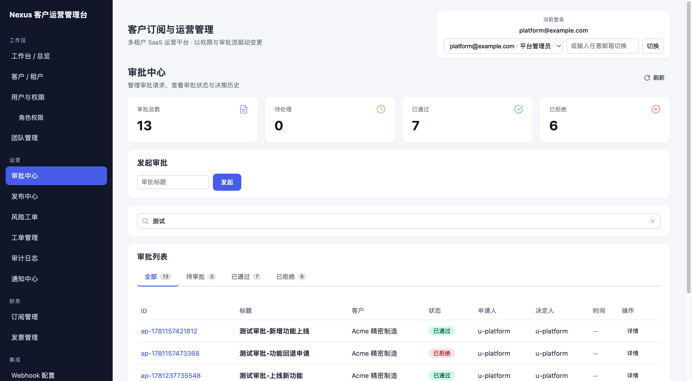
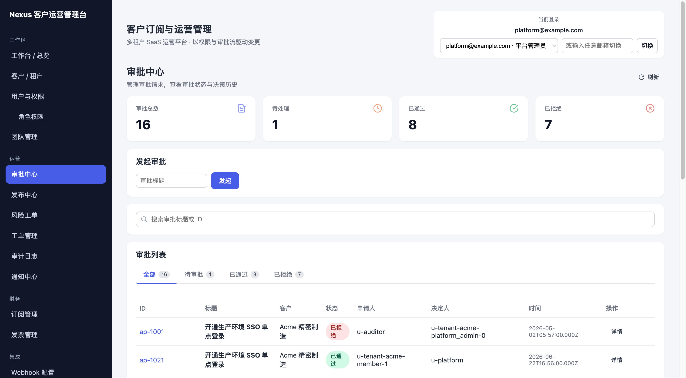
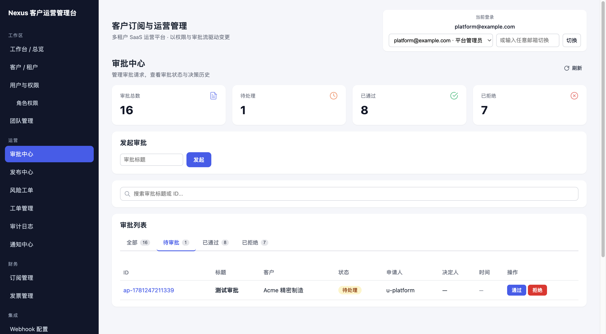
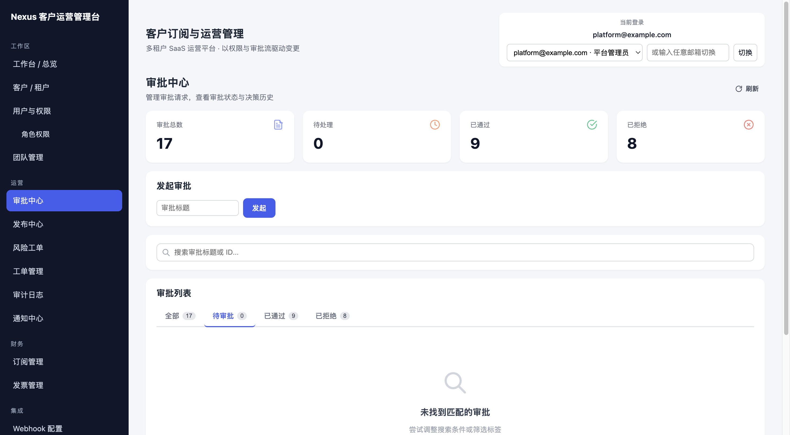

# 审批中心页面黑盒测试结果

> 测试时间：2026-06-12 15:21
> 测试页面：http://localhost:5176/approvals
> 测试工具：browser_use agent

---

## 步骤 1：加载审批中心页面

导航到审批中心页面，等待页面完全加载。初始状态显示全部审批记录。

---

## 步骤 2：切换到"待审批"Tab

点击"待审批"Tab，筛选出状态为"待审批"的审批记录。

---

## 步骤 3：切换到"已通过"Tab

点击"已通过"Tab，筛选出状态为"已通过"的审批记录。

---

## 步骤 4：切换到"已拒绝"Tab

点击"已拒绝"Tab，筛选出状态为"已拒绝"的审批记录。

---

## 步骤 5：切回"全部"Tab

点击"全部"Tab，恢复显示所有审批记录。（无需截图）

---

## 步骤 6：搜索框输入关键词

在搜索框中输入关键词"测试"，页面根据关键词过滤审批记录。

---

## 步骤 7：清空搜索框

清空搜索框内容，恢复显示全部审批记录。（无需截图）

---

## 步骤 8：点击审批 ID 打开详情 Modal

点击某条审批记录的 ID，打开审批详情 Modal，显示审批的完整信息。

---

## 步骤 9：关闭 Modal

关闭审批详情 Modal，返回审批列表。（无需截图）

---

## 步骤 10：发起新审批

在发起审批表单中输入标题"测试审批"，点击发起按钮。新审批创建成功，出现在待审批列表中。

---

## 步骤 11：通过审批

对一条待审批记录点击"通过"按钮，审批状态变为"已通过"。

---

## 步骤 12：拒绝审批

先发起一个新的审批（标题"待拒绝审批"），然后对该记录点击"拒绝"按钮，审批状态变为"已拒绝"。

---

## 测试总结

| 步骤 | 操作 | 截图 | 结果 |
|------|------|------|------|
| 1 | 加载审批中心页面 | step_01.png | 通过 |
| 2 | 切换到"待审批"Tab | step_02.png | 通过 |
| 3 | 切换到"已通过"Tab | step_03.png | 通过 |
| 4 | 切换到"已拒绝"Tab | step_04.png | 通过 |
| 5 | 切回"全部"Tab | - | 通过 |
| 6 | 搜索框输入关键词 | step_06.png | 通过 |
| 7 | 清空搜索框 | - | 通过 |
| 8 | 打开审批详情 Modal | step_08.png | 通过 |
| 9 | 关闭 Modal | - | 通过 |
| 10 | 发起新审批 | step_10.png | 通过 |
| 11 | 通过审批 | step_11.png | 通过 |
| 12 | 拒绝审批 | step_12.png | 通过 |

**结论**：审批中心页面的 Tab 切换、搜索过滤、详情查看、发起审批、通过/拒绝操作均正常工作。
